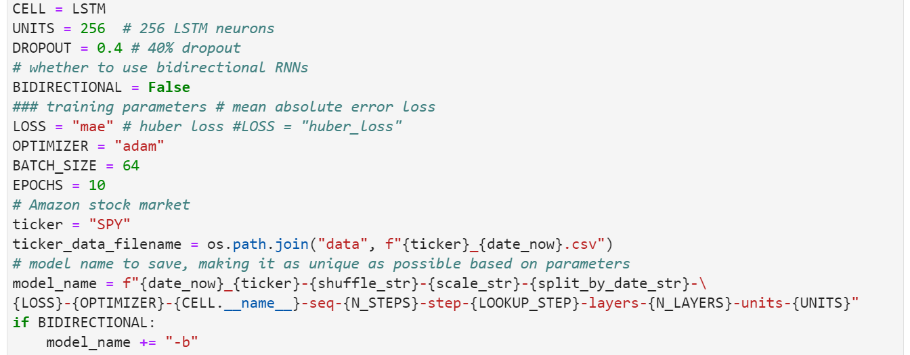
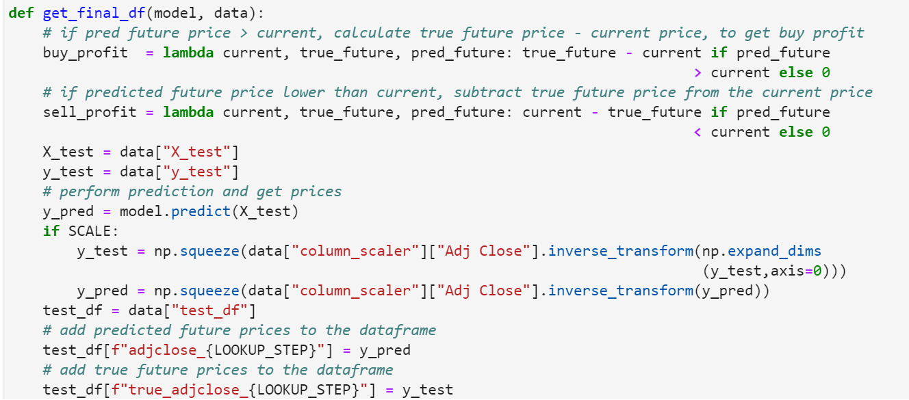

# Bot-Time

# Project 2 Fintech 
- The Bot-Time project resulted in the building of a profitable automated trading bot that uses deep learning to make trades on Webull.
- A demo account has been setup on WeBull that is being migrated to a live trading account.
- Several RNN were constructed and fit to determine buying and selling decisions.
- We will compare the performance of these models and potentially combine their choices to build an automated trading bot.
- Dash Gallery was used to create the front-end that enables user to monitor the bots performance and adjust the dominant model taking trades.

# The Project
## Gathering the Data:
This is how we read-in the data:
 

## Reading In The Data:
This is how we read-in the data:
1. Stock Tickers Price Data

## Test-Train-Split:
We had to drop columns, set/reset indexes, replace values. We also had to use try & except statements to read in the data without ending the functions on error.

## Load for Dash:
- This is the 1st combined dataframe of the stock price & summary info:

This function takes the "model" and "data" dict to construct a final dataframe that includes the features along with true and predicted prices of the testing dataset

## Prediction:

## Accuracy:

#Data Visualizations:
## Plot:

## Some Dash Visualizations:
Bollinger Bands:

Interactive Candlestick Chart with panel selector:

EMA Crossover Points:

Prediction Chart:

RSI Indicator Chart:

Webull Options Chain:

## Final Analysis:

When deciding on a trading strategy, one might consider using indicators to help guide the decision whether to buy, sell or hold a position. Some of the indicators explored in the Bot-Time project are Bollinger Bands, EMA Crossover Point and RSI Indicators.  Here are some illustrations that show how they were used in the Bot-Time strategy

===============================================================================
## Charts & Analysis:
### (Sum Total column indicates the ranking values)
1. These are the Communications & Consumer Sector Rankings:

2. These are the Energy & Financial Sector Rankings:

3. These are the Tech Sector Rankings:
